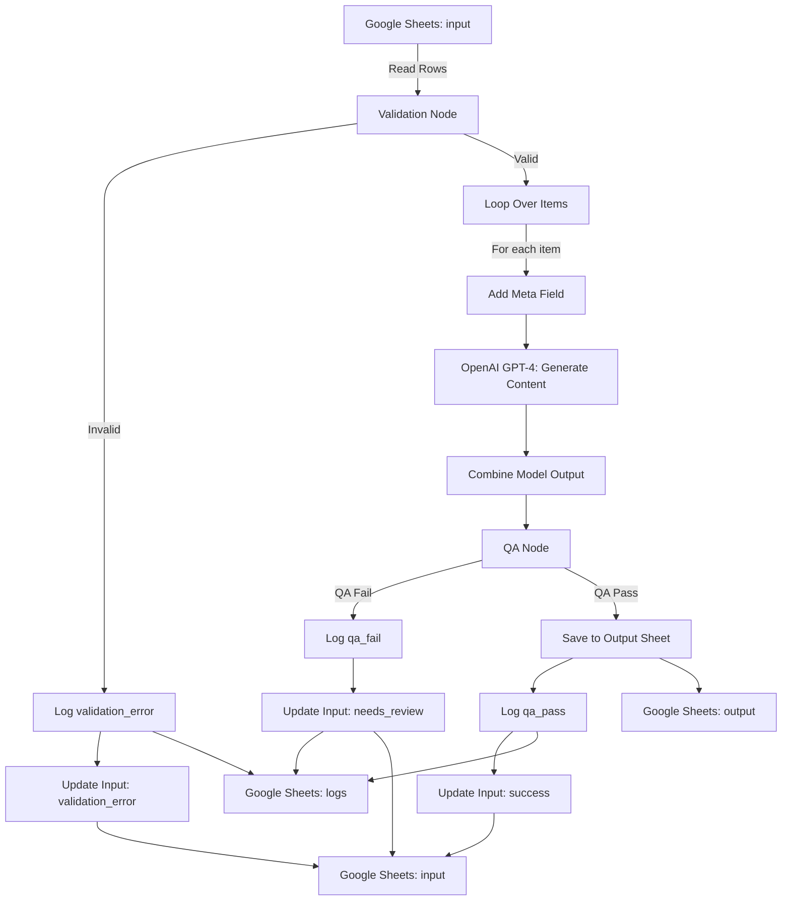

[ARCHITECTURE.md](https://github.com/user-attachments/files/25278642/ARCHITECTURE.md)
# Architecture Documentation

Detailed technical architecture of the AI Content Generation Pipeline.

---

## System Overview

The pipeline implements a **three-stage process** with **quality gates** at each level:

```
Input Validation → Content Generation → Quality Assurance → Output
       ↓                    ↓                    ↓              ↓
    Logs DB             Logs DB             Logs DB       Approved
                                                          Content
```

---

## Data Flow Diagram



---

## Node-by-Node Breakdown

### 1. Trigger: When Clicking 'Execute Workflow'

**Type:** Manual Trigger

**Purpose:** Start the workflow on-demand

**Future Enhancement:** Replace with Schedule Trigger for automation

---

### 2. Get row(s) in sheet

**Type:** Google Sheets (Read)

**Configuration:**
- Operation: Get Many
- Sheet: `input`
- Return All: Yes

**Output:** Array of all rows from input sheet

**Note:** Returns ALL rows, filtering happens in next node

---

### 3. Validation Node

**Type:** Code (JavaScript)

**Purpose:** Validate and normalize input data

**Key Functions:**

```javascript
// 1. Filter unprocessed items
items = items.filter(item => {
  const v = (item.json.n8n_processed_at ?? '').toString().trim();
  return v === '';
});

// 2. Normalize values
const id = norm(row.id);
const language = norm(row.language).toUpperCase();
const length = norm(row.length).toLowerCase();

// 3. Validate against rules
const allowedLanguages = new Set(['EN', 'ES']);
const allowedLengths = new Set(['short', 'medium']);

// 4. Build error messages
const errors = [];
if (!id) errors.push({ field: 'id', message: 'missing id' });
if (!allowedLanguages.has(language)) {
  errors.push({ field: 'language', message: `invalid language: ${language}` });
}

// 5. Return structured output
return items.map(item => ({
  json: {
    ...row,
    is_valid: errors.length === 0,
    hasError: errors.length > 0,
    status: errors.length === 0 ? 'ok' : 'error',
    message: error_messages.join(' | ')
  }
}));
```

**Output Fields:**
- All original fields (id, topic, etc.)
- `is_valid`: boolean
- `hasError`: boolean
- `status`: "ok" | "error"
- `message`: error details
- `timestamp`: ISO timestamp

---

### 4. If (validation check)

**Type:** Conditional (IF)

**Condition:** `={{ $json.is_valid }}`

**Branches:**
- **True:** Items pass validation → continue to Loop
- **False:** Items have errors → log and update

---

### 5a. Append to logs (validation error)

**Type:** Google Sheets (Write)

**Branch:** False (validation failures)

**Configuration:**
- Operation: Append or Update Row
- Sheet: `logs`
- Mapping: Manual
- Cell Format: Let n8n format

**Fields Written:**
- `timestamp`: When error occurred
- `id`: Brief ID
- `event_type`: "validation_error"
- `step`: "validation"
- `status`: "error"
- `message`: Error details

---

### 5b. Update input (validation error)

**Type:** Google Sheets (Update)

**Purpose:** Mark failed items in input sheet

**Configuration:**
- Operation: Update Row
- Sheet: `input`
- Match on: `id`

**Fields Updated:**
- `n8n_validation_status`: "error"
- `n8n_validation_notes`: Error message
- `n8n_processed_at`: Timestamp

**Note:** Stops processing for this item (won't call API)

---

### 6. Loop Over Items

**Type:** Loop

**Purpose:** Process valid items one by one

**Configuration:**
- Batch Size: 1 (sequential processing)

**Why Sequential:**
- Easier debugging
- Rate limit control
- Clear error isolation
- Recommended for API-heavy workflows

**Outputs:**
- `loop`: Emits each item
- `done`: Triggers when all items processed

---

### 7. Add meta field

**Type:** Code (JavaScript)

**Purpose:** Create metadata payload for API

**Code:**
```javascript
const { id, topic, audience, language, length } = $json;

return {
  json: { 
    id,
    topic,
    audience,
    language,
    length,
    meta: JSON.stringify({ id, topic, audience, language, length })
  }
};
```

**Why Needed:** API prompt requires metadata in specific format

---

### 8. Message a model

**Type:** OpenAI

**Configuration:**
- Model: `gpt-4` or `gpt-4-turbo`
- Resource: Text
- Operation: Message a Model

**Prompt Structure:**
```javascript
`You are a UGC content generator. Follow these rules EXACTLY.

INPUT DATA:
id: ${$json.id}
topic: ${$json.topic}
audience: ${$json.audience}
language: ${$json.language}
length: ${$json.length}

CRITICAL VALIDATION RULES:
1. EXACT COPY: id, language, and length must match input
2. WORD COUNT: ${length === 'short' ? '90-140' : '180-260'} words
3. TITLE: 5-12 words
4. BODY FORMAT: 2-4 paragraphs separated by \n\n

OUTPUT FORMAT (JSON only):
{
  "id": "${$json.id}",
  "language": "${$json.language}",
  "length": "${$json.length}",
  "title": "<your 5-12 word title>",
  "body": "<your body with paragraphs>"
}`
```

**Output:** GPT-4's response in JSON format

---

### 9. Combine model output

**Type:** Code (JavaScript)

**Purpose:** Merge API response with original metadata

**Why Needed:** "Message a model" node only outputs API response, losing original data

**Code:**
```javascript
const modelOutput = $json.output;
const previousData = $("Add meta field").item.json;

return {
  json: {
    ...previousData,
    output: modelOutput
  }
};
```

**Output:** Combined object with both original data and API response

---

### 10. QA node

**Type:** Code (JavaScript)

**Purpose:** Validate generated content against specifications

**Validation Steps:**

**Step 1: Parse JSON**
```javascript
const raw = $json?.output?.[0]?.content?.[0]?.text ?? "";
const parsed = JSON.parse(text);
```

**Step 2: Schema Validation**
```javascript
const expected = ["id", "language", "length", "title", "body"];
const keys = Object.keys(parsed);
const hasAll = expected.every(k => keys.includes(k));
const noExtra = keys.every(k => expected.includes(k));
```

**Step 3: Metadata Match**
```javascript
if (String(parsed.id) !== String(meta.id)) {
  fail("qa_fail_mismatch", `id mismatch`);
}
```

**Step 4: Title Rules**
```javascript
const titleWords = title.split(/\s+/).filter(Boolean).length;
if (titleWords < 5 || titleWords > 12) {
  fail("qa_fail_title", "title must be 5-12 words");
}
```

**Step 5: Body Rules**
```javascript
const words = body.split(/\s+/).filter(Boolean).length;
const isShort = meta.length === "short";
const min = isShort ? 90 : 180;
const max = isShort ? 140 : 260;
if (words < min || words > max) {
  fail("qa_fail_length", `body words out of range`);
}
```

**Output Fields:**
- All original fields
- `qa_ok`: boolean
- `qa_status`: "qa_ok" | "qa_fail_*"
- `qa_message`: Details if failed
- `title`: Extracted from API response
- `body`: Extracted from API response

---

### 11. If (QA check)

**Type:** Conditional (IF)

**Condition:** `={{ $json.qa_ok }}`

**Branches:**
- **True:** Content passed QA → save to output
- **False:** Content failed QA → log and mark for review

---

### 12a. Append to output

**Type:** Google Sheets (Write)

**Branch:** True (QA pass)

**Purpose:** Save approved content

**Configuration:**
- Operation: Append or Update Row
- Sheet: `output`
- Mapping: Auto-map
- Match on: `id` (prevents duplicates)

**Fields Written:** All fields from QA node output

---

### 12b. Append to logs (QA pass)

**Type:** Google Sheets (Write)

**Purpose:** Log successful generation

**Fields Written:**
- `timestamp`: When content approved
- `id`: Brief ID
- `event_type`: "qa_pass"
- `step`: "qa"
- `status`: "qa_ok"
- `message`: "Content generated successfully"

---

### 12c. Update input (QA pass)

**Type:** Google Sheets (Update)

**Purpose:** Mark successful items

**Fields Updated:**
- `qa_status`: "qa_ok"
- `qa_message`: "ok"
- `n8n_processed_at`: Timestamp

**Important:** Uses node references to avoid context loss:
```javascript
id: {{ $('QA node').item.json.id }}
qa_status: {{ $('QA node').item.json.qa_status }}
```

---

### 13a. Append to logs (QA fail)

**Type:** Google Sheets (Write)

**Branch:** False (QA fail)

**Purpose:** Log failed QA checks

**Fields Written:**
- `event_type`: "qa_fail"
- `status`: QA failure type
- `message`: Why it failed

---

### 13b. Update input (QA fail)

**Type:** Google Sheets (Update)

**Purpose:** Mark items needing review

**Fields Updated:**
- `qa_status`: QA failure code
- `qa_message`: Error details
- `n8n_processed_at`: Timestamp

---

## Data Models

### Input Item
```typescript
{
  id: string;              // Required, unique
  topic: string;           // Required
  audience: string;        // Required
  language: 'EN' | 'ES';   // Required
  length: 'short' | 'medium';  // Required
  
  // Auto-populated by workflow
  validation_status?: string;
  validation_notes?: string;
  n8n_validation_status?: string;
  n8n_validation_notes?: string;
  qa_status?: string;
  qa_message?: string;
  n8n_processed_at?: string;  // ISO timestamp
}
```

### Validation Output
```typescript
{
  ...InputItem,
  is_valid: boolean;
  hasError: boolean;
  status: 'ok' | 'error';
  message: string;
  timestamp: string;  // ISO format
}
```

### QA Output
```typescript
{
  ...InputItem,
  title: string;
  body: string;
  qa_ok: boolean;
  qa_status: string;
  qa_message: string;
  generated_at: string;  // ISO timestamp
  raw_response: string;  // Full API response
}
```

### Log Entry
```typescript
{
  timestamp: string;  // ISO format
  id: string;
  event_type: 'validation_error' | 'qa_pass' | 'qa_fail';
  step: 'validation' | 'qa';
  status: string;
  message: string;
}
```

---

## Error Handling Strategy

### Level 1: Input Validation
- **Catch:** Missing/invalid fields
- **Action:** Log + mark in input sheet
- **Recovery:** Manual fix + re-run

### Level 2: API Errors
- **Catch:** Network errors, API limits, malformed responses
- **Action:** Currently fails workflow
- **Future:** Retry logic with exponential backoff

### Level 3: QA Failures
- **Catch:** Content doesn't meet specs
- **Action:** Log + mark for review
- **Recovery:** Re-generate with adjusted prompt

---

## Performance Considerations

### Bottlenecks
1. **API Calls:** ~2-5s per item
2. **Google Sheets Writes:** ~200-500ms per write
3. **Loop Processing:** Sequential (Batch Size = 1)

### Scaling Limits
- **Current:** ~10-20 items/minute
- **With Parallel Processing:** 100+ items/minute
- **API Rate Limits:** GPT-4 varies by tier

### Optimization Opportunities
1. Increase Batch Size (if rate limits allow)
2. Cache common prompts
3. Batch Google Sheets writes
4. Implement async processing with webhooks

---

## Security Considerations

### API Keys
- Store in n8n credentials (encrypted)
- Never commit to repository
- Rotate regularly

### Data Privacy
- Google Sheets may contain PII
- Ensure proper access controls
- Consider data retention policies

### Rate Limiting
- Respect API provider limits
- Implement exponential backoff
- Monitor usage to avoid overages

---

*Last updated: February 2026*
